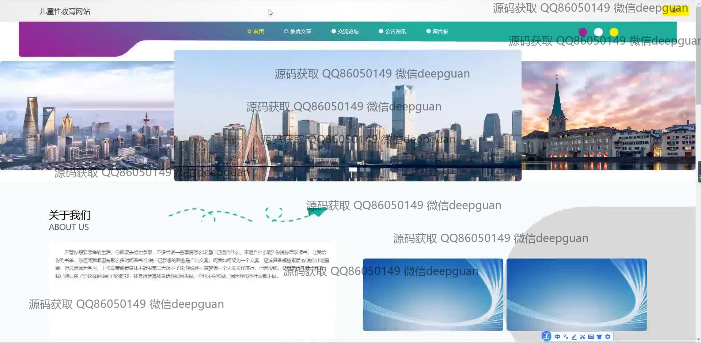

<h1 align="center">儿童性教育网站</h1>

## 简介
儿童性教育网站：角色分为管理员、用户。功能包括注册登录、用户管理、文章和分类管理、交流论坛、留言板、教育资源浏览。界面设计简洁，注重用户友好性，实现信息管理与互动。    --计算机毕业设计源码；毕设源码；java毕业设计源码

## 联系方式

<h3 align="center">获取完整代码与数据库文件 + 微信：deepguan QQ: 86050149 QQ群: 783742310</h3>

<h3 align="center">可帮忙远程部署 包运行成功！提供远程部署、修改代码、设计文档指导、代码讲解等服务！</h3>

## 功能介绍（完整见运行截图）
管理员：基本功能包括系统登录、注册和退出。网站首页设有主导航栏，便捷访问各模块。用户管理功能展示用户列表，提供用户信息的查看、修改和删除选项。文章管理功能支持文章分类和内容编辑，提供上传文章和封面的功能。交流功能支持留言板和论坛的管理，包括评论和回复操作。后台界面设计简洁，方便管理员进行网站内容组织和用户互动。

用户：用户可以进行注册和登录，访问网站首页的导航栏和城市风景幻灯片。功能模块包括教育文章、交流论坛、公告资讯、留言板和个人中心等。用户信息管理支持头像上传，以及个人信息的查看和修改。用户互动通过论坛和留言板实现，支持评论、发表和回复功能。网站提供教育资源的访问与搜索功能，以促进儿童性教育的学习和交流。

## 运行截图

本代码来源于网络,仅供学习参考使用!

